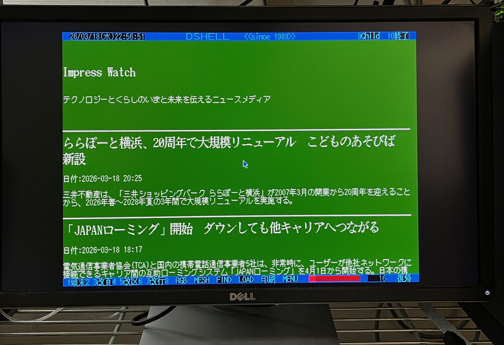

# rssnx

Native RSS Reader for Human68k + wget + DSHELL

## About This

RSSNX は、X680x0/Human68k 上でネイティブ動作する、RSS News Reader です。

- データ取得にyunk氏のwget for x68kを使用
- ユーザーインターフェイスとして電脳倶楽部のDSHELLを採用
- あらかじめ実績のあるいくつかのRSSサイトを定義済み



<br/>
<br/>

以下での動作を確認しています。

- X68030/060turbo実機 + イーサネットじょい君 + joynetd.x
- X68000XVI実機 + Neriori + inetd.x

---

## インストール方法

前提条件として、ネットワークに接続し、インターネットにアクセスできる状況になっていること。

yunk氏のイーサネットじょい君と`joynetd`の利用がとても簡単でお勧めです。

- https://yunkya2.booth.pm/items/8063175
- https://github.com/yunkya2/joynetd

yunk氏の wget for x68k (`wget.x`) がパスの通ったディレクトリに導入されていること。
- https://github.com/yunkya2/wget-x68k

`DSHL320E.LZH` をダウンロードして解凍し、DSHELL.X をパスの通ったディレクトリに置きます。すでに wget.x が利用可能であれば、以下のコマンドで直接68上でダウンロードすることができます。

```
wget https://github.com/tantanGH/rssnx/releases/download/v0.2.0/DSHL320E.LZH
```

`RSSNXxxx.ZIP` をダウンロードして解凍し、RSSNX.X をパスの通ったディレクトリに置きます。すでに wget.x が利用可能であれば、以下のコマンドで直接68上でダウンロードすることができます。

```
wget https://github.com/tantanGH/rssnx/releases/download/v0.2.0/RSSNX020.ZIP
```

---

## 起動方法および操作方法

以下のコマンドで、dshellを使って添付のRSSN.DOCを開きます。

```
dshell RSSNX.DOC
```

DSHELLの基本操作：
- ◎クリックでリンクを辿る
- 左右同時クリックで戻る
- 左クリックで下方向へのスクロール
- 右クリックで上方向へのスクロール

RSSの各記事はセクションに分かれており、「改区」を押すことで記事単位で読み進めることもできます。

カレントディクレトリに作業ファイルとして `_D.D` `_R.D` という名前のファイルが作られますのでご了承ください。

---

## RSSサイト追加方法

いくつかのメジャーなRSSサイトで、かつ現状のWGET.Xでアクセス可能なものはあらかじめ `RSSNX.DOC` 内に定義されています。

`RSSNX.DOC`はテキストファイル(DSHELLマークアップ形式)ですので、ED.Xなどで編集してご自身で追加することも可能です。ただしリンクの書式は以下に従ってください。

`TYPE=EDE:RSSNX (RSSフィードURL);_R.D`

例：
```
TYPE=EDE:RSSNX https://akiba-pc.watch.impress.co.jp/data/rss/1.0/ah/feed.rdf;_R.D
```

---

## Copyright

XMLパーサーとして、yxmlを利用させていただいております。

  Copyright (c) 2013-2014 Yoran Heling

  Permission is hereby granted, free of charge, to any person obtaining
  a copy of this software and associated documentation files (the
  "Software"), to deal in the Software without restriction, including
  without limitation the rights to use, copy, modify, merge, publish,
  distribute, sublicense, and/or sell copies of the Software, and to
  permit persons to whom the Software is furnished to do so, subject to
  the following conditions:

  The above copyright notice and this permission notice shall be included
  in all copies or substantial portions of the Software.

  THE SOFTWARE IS PROVIDED "AS IS", WITHOUT WARRANTY OF ANY KIND,
  EXPRESS OR IMPLIED, INCLUDING BUT NOT LIMITED TO THE WARRANTIES OF
  MERCHANTABILITY, FITNESS FOR A PARTICULAR PURPOSE AND NONINFRINGEMENT.
  IN NO EVENT SHALL THE AUTHORS OR COPYRIGHT HOLDERS BE LIABLE FOR ANY
  CLAIM, DAMAGES OR OTHER LIABILITY, WHETHER IN AN ACTION OF CONTRACT,
  TORT OR OTHERWISE, ARISING FROM, OUT OF OR IN CONNECTION WITH THE
  SOFTWARE OR THE USE OR OTHER DEALINGS IN THE SOFTWARE.

---

## 変更履歴

version 0.2.0 (2026.03.19) ... 初版